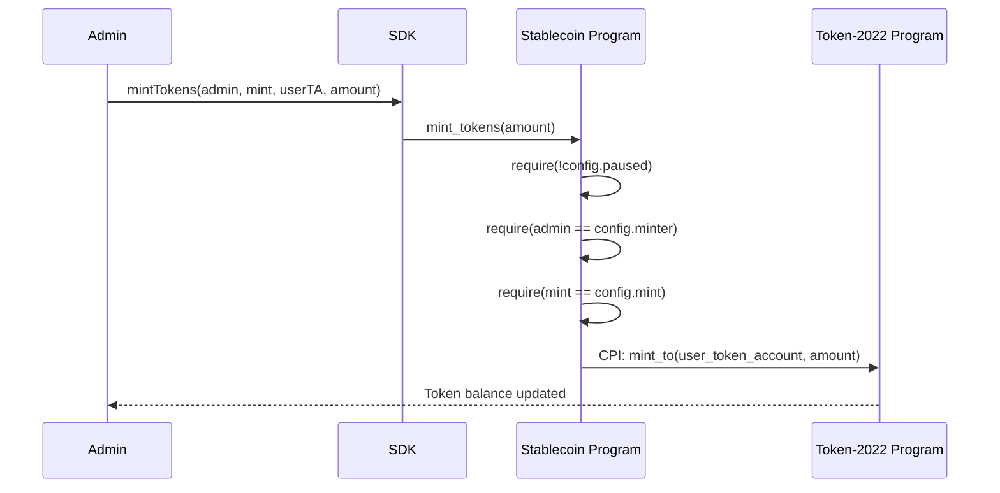
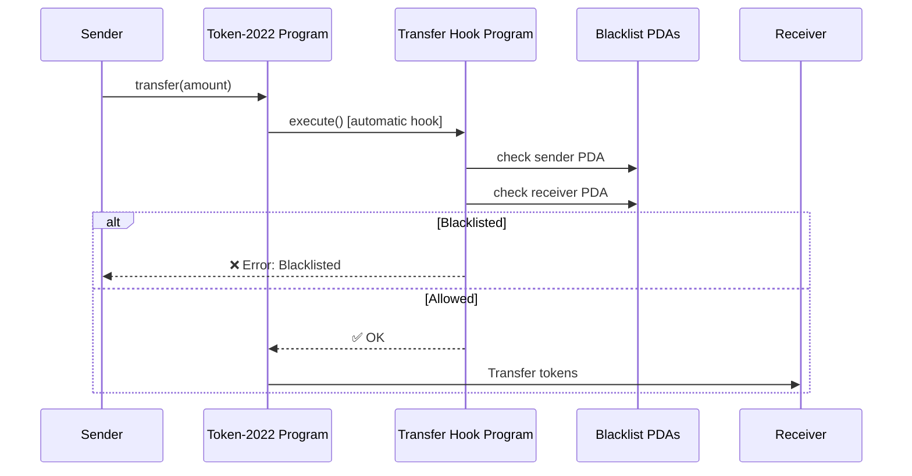
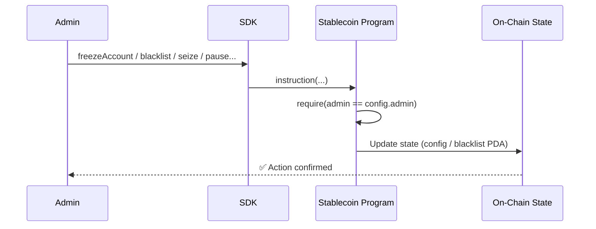
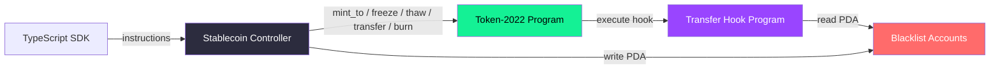

# Architecture

This document describes the system architecture of the Solana Stablecoin Standard implementation, covering the layer model, data flows, and security model.

---

## Layer Model

The architecture is organized into **three layers** — mirroring the OpenZeppelin model: the library (SDK) is the core deliverable, the standards (SSS-1, SSS-2) are opinionated presets built on top of it.

```
┌────────────────────────────────────────────────────────────────────┐
│  Layer 3 — Standard Presets                                        │
│  SSS-1 (Minimal)  ·  SSS-2 (Compliant)  ·  SSS-3 (Private, PoC)  │
├────────────────────────────────────────────────────────────────────┤
│  Layer 2 — Modules (composable, independently testable)            │
│  Compliance Module  ·  Privacy Module  ·  Oracle Integration       │
│  (transfer hook, blacklist PDAs, permanent delegate)               │
├────────────────────────────────────────────────────────────────────┤
│  Layer 1 — Base SDK                                                │
│  Token creation · Mint authority · Freeze authority · Metadata     │
│  Role management program · CLI · TypeScript SDK                    │
└────────────────────────────────────────────────────────────────────┘
```

### Layer 1 — Base SDK
| Component | Role |
|---|---|
| **Token Creation** | Token-2022 mint with configurable extensions |
| **Role Management Program** | Master authority, minter, burner, pauser (configurable per deploy) |
| **TypeScript SDK** | `SolanaStablecoin.create()` with preset or custom config |
| **Admin CLI** | `sss-token` commands for all operator actions |

### Layer 2 — Modules
| Module | Extensions Used | Purpose |
|---|---|---|
| **Compliance Module** | Permanent Delegate, Transfer Hook, Blacklist PDAs | Proactive transfer enforcement (SSS-2) |
| **Privacy Module** | Confidential Transfers, Allowlists | Private transfers (SSS-3, experimental) |
| **Oracle Module** | Switchboard feeds | Non-USD peg pricing (EUR, BRL, CPI) |

### Layer 3 — Standard Presets
| Preset | Base | Modules | Use Case |
|---|---|---|---|
| **SSS-1** (Minimal) | Layer 1 | None | DAO treasury, ecosystem settlement |
| **SSS-2** (Compliant) | Layer 1 | Compliance | Regulated stablecoins (USDC-class) |
| **SSS-3** (Private) | Layer 1 | Privacy | Confidential transfer stablecoins (PoC) |

### 2. Protocol Layer
| Component | Address (Devnet) | Role |
|---|---|---|
| **Stablecoin Controller** | `CmEzDTfuEvkBxcki6mNEYZUHKAjYNkiK7rk6Wmcgx4Vh` | Core business logic, admin operations, state |
| **Transfer Hook Program** | `C7TEPRE4dATYHHV3wafWybBD6z5FkngfAuBVNvezmBA4` | Real-time compliance enforcement on every transfer |
| **Token-2022 Program** | Native SPL | Advanced token standard used for mint operations |

### 3. Infrastructure Layer
| Component | Role |
|---|---|
| **Solana Runtime** | Blockchain execution environment, consensus |
| **RPC Nodes** | Network access and transaction submission |
| **Indexers** | Off-chain data aggregation and event streaming |

---

## Data Flows

### Token Minting Flow



### Transfer Flow with Compliance Hook



### Administrative Operations Flow



---

## Security Model

### Role-Based Authority

| Role | Capabilities | Stored In |
|---|---|---|
| **Admin** | Freeze, thaw, blacklist, seize, pause, update minter, transfer authority | `StablecoinConfig.admin` |
| **Minter** | Mint tokens (only when protocol not paused) | `StablecoinConfig.minter` |
| **User** | Burn own tokens | Token account ownership |

All admin-gated instructions enforce:
```rust
require!(ctx.accounts.admin.key() == config.admin, ErrorCode::Unauthorized);
```

### Emergency Controls

| Mechanism | Trigger | Effect |
|---|---|---|
| **Pause** | `pause()` by admin | Blocks all `mint_tokens` operations |
| **Freeze** | `freeze_account()` by admin | Target token account cannot send or receive |
| **Blacklist** | `add_to_blacklist()` by admin | Blocked at Transfer Hook; all transfers fail atomically |
| **Seize** | `seize()` by admin | Forced transfer of user tokens to treasury |

### Transfer Hook Compliance

The Transfer Hook program is registered on the Token-2022 mint. It is invoked automatically by the Token-2022 program on **every** `transfer` or `transferChecked` instruction. This means compliance cannot be bypassed at the client layer.

```
Token-2022 Program → Transfer Hook Program → [check Blacklist PDAs] → approve / reject
```

- **Atomic**: The hook runs in the same transaction as the transfer; rejection reverts the entire transaction.
- **Real-time**: No off-chain delay; compliance is enforced at the block level.

### PDA-Derived Blacklist

Blacklist entries are stored as deterministic PDAs:

```rust
seeds = [b"blacklist", wallet.as_ref()]
```

This ensures:
- **Gas-efficient lookup**: No iteration; O(1) PDA derivation
- **Tamper-proof**: Cannot be spoofed from outside the program
- **Removable**: Closed (lamports returned to admin) on `remove_from_blacklist`

---

## State Accounts

### `StablecoinConfig`

```rust
pub struct StablecoinConfig {
    pub admin: Pubkey,      // Administrative authority (32 bytes)
    pub mint: Pubkey,       // Associated token mint (32 bytes)
    pub treasury: Pubkey,   // Treasury token account (32 bytes)
    pub decimals: u8,       // Token decimal places (1 byte)
    pub paused: bool,       // Protocol pause state (1 byte)
    pub minter: Pubkey,     // Authorized minter (32 bytes)
}
// Total: 8 (discriminator) + 32+32+32+1+1+32 = 138 bytes
```

### `Blacklist`

```rust
pub struct Blacklist {
    pub wallet: Pubkey,     // Blacklisted wallet address (32 bytes)
}
// Total: 8 (discriminator) + 32 = 40 bytes
// PDA: ["blacklist", wallet_pubkey]
```

---

## Program Interactions (CPI Map)



---

## Error Codes

| Code | Message | Cause |
|---|---|---|
| `Unauthorized` | "Unauthorized" | Signer is not the admin/minter |
| `ProtocolPaused` | "Protocol is paused" | Minting attempted while paused |
| `InvalidMint` | "Invalid mint account" | Provided mint doesn't match config |
| `Blacklisted` | "Wallet is blacklisted" | Transfer involving blacklisted wallet |

---

## Upgradeability

The architecture is designed for independent upgradeability:

- **Stablecoin Controller** can be upgraded without affecting the Transfer Hook or token mint.
- **Transfer Hook** can be swapped or upgraded by pointing the Token-2022 mint's hook authority to a new program.
- **SDK** provides a versioned abstraction layer; application code doesn't need to know program addresses.

> **Note:** Solana programs deployed with `anchor deploy` are upgradeable by default (the upgrade authority is the deployer's keypair). For mainnet, it is recommended to either make programs immutable or use a multisig upgrade authority.