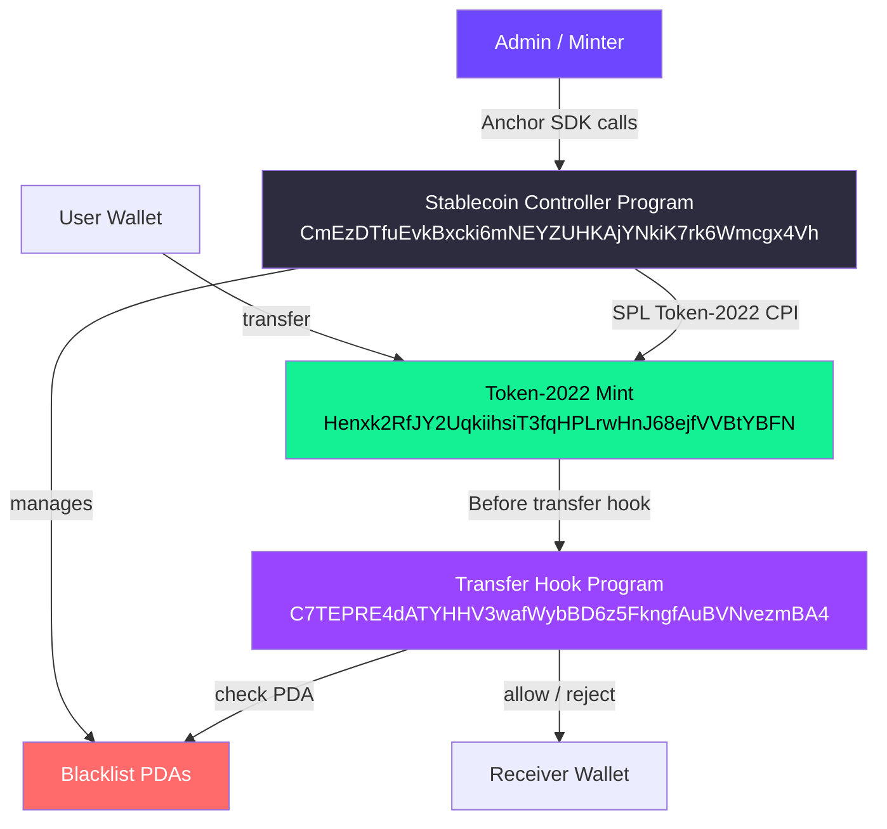

# Solana Stablecoin Standard

> A production-ready, compliance-enforced **Token-2022 stablecoin implementation on Solana** with blacklist enforcement, freeze controls, transfer hook compliance, and a developer TypeScript SDK.

[](https://explorer.solana.com)
[](https://www.anchor-lang.com/)
[](https://spl.solana.com/token-2022)
[](LICENSE)

---

## Overview

This project implements the **Solana Stablecoin Standard (SSS)**, a two-tier specification for on-chain stablecoin compliance:

| Standard | Key Features |
|---|---|
| **SSS-1** (Minimal) | `initialize`, `mint`, `burn`, `pause` - bare minimum functional stablecoin |
| **SSS-2** (Compliant) | SSS-1 + `freeze`, `thaw`, `blacklist`, `seize`, `transferAuthority`, Transfer Hook |

This implementation is **SSS-2 compliant** by default, suitable for regulated environments requiring USDC-style controls.

---

## Quick Start

### 1. Prerequisites

```bash
# Install Solana CLI
sh -c "$(curl -sSfL https://release.solana.com/stable/install)"

# Install Anchor CLI
cargo install --git https://github.com/coral-xyz/anchor avm --locked
avm install latest && avm use latest

# Install Node dependencies
cd sdk && npm install
```

### 2. Build & Deploy

```bash
# Build programs
anchor build

# Run tests
anchor test

# Deploy to devnet
anchor deploy --provider.cluster devnet
```

### 3. Initialize the Stablecoin

```typescript
import * as anchor from "@coral-xyz/anchor";
import { StablecoinSDK } from "./sdk";

const provider = anchor.AnchorProvider.env();
const sdk = new StablecoinSDK(provider);

// Deploy and initialize with 6 decimals
await sdk.initializeStablecoin(adminKeypair, mintAddress, treasuryAddress, 6);
```

### 4. Mint Tokens

```typescript
await sdk.mintTokens(
  admin.publicKey,    // authorized minter
  mint,               // token mint address
  userTokenAccount,   // recipient token account
  1_000_000           // amount (in smallest unit, 1 USDS = 1,000,000)
);
```

---

## Preset Comparison

| Feature | SSS-1 (Minimal) | SSS-2 (Compliant) |
|---|:---:|:---:|
| Initialize stablecoin | ✅ | ✅ |
| Mint tokens | ✅ | ✅ |
| Burn tokens | ✅ | ✅ |
| Emergency pause | ✅ | ✅ |
| Freeze / Thaw accounts | ❌ | ✅ |
| Wallet blacklisting | ❌ | ✅ |
| Token seizure | ❌ | ✅ |
| Transfer Hook compliance | ❌ | ✅ |
| Admin authority transfer | ❌ | ✅ |
| Minter role management | ❌ | ✅ |
| On-chain audit events | ❌ | ✅ |

---

## Architecture



**Transfer flow:**
1. User initiates token transfer via Token-2022
2. Token-2022 calls the Transfer Hook Program **automatically** before completing the transfer
3. Transfer Hook checks if sender/receiver are blacklisted
4. Transfer is approved or rejected on-chain, atomically

---

## Programs

| Program | Address (Devnet) | Purpose |
|---|---|---|
| Stablecoin Controller | `CmEzDTfuEvkBxcki6mNEYZUHKAjYNkiK7rk6Wmcgx4Vh` | Admin, mint, burn, freeze, blacklist, seize |
| Transfer Hook | `C7TEPRE4dATYHHV3wafWybBD6z5FkngfAuBVNvezmBA4` | On-transfer compliance validation |

**Token:**
| Property | Value |
|---|---|
| Mint Address | `Henxk2RfJY2UqkiihsiT3fqHPLrwHnJ68ejfVVBtYBFN` |
| Standard | Token-2022 |
| Decimals | 6 |

---

## Project Structure

```
my-solana-project/
├── programs/
│   ├── my-solana-project/src/
│   │   ├── lib.rs               # Main program: all instructions & account structs
│   │   └── state/
│   │       ├── stablecoin_config.rs  # StablecoinConfig account
│   │       └── blacklist.rs          # Blacklist account
│   └── transfer_hook/src/
│       └── lib.rs               # Transfer hook: compliance validation
├── sdk/
│   ├── stablecoin.ts            # StablecoinSDK class
│   ├── constants.ts             # Program IDs and addresses
│   ├── index.ts                 # SDK entry point
│   └── my_solana_project.json   # Anchor IDL
├── Anchor.toml
└── Cargo.toml
```

---

## Key Instructions

| Instruction | Authority | Description |
|---|---|---|
| `initialize_stablecoin` | Admin | Bootstrap config, mint, treasury |
| `create_mint` | Admin | Create the SPL Token-2022 mint |
| `mint_tokens` | Minter | Issue tokens to a recipient |
| `burn_tokens` | User | Destroy tokens from own account |
| `freeze_account` | Admin | Freeze a user's token account |
| `thaw_account` | Admin | Unfreeze a frozen token account |
| `pause` | Admin | Halt all minting operations |
| `unpause` | Admin | Resume normal operations |
| `add_to_blacklist` | Admin | Block a wallet from all transfers |
| `remove_from_blacklist` | Admin | Lift blacklist restriction |
| `seize` | Admin | Transfer tokens to treasury |
| `update_minter` | Admin | Change authorized minter |
| `transfer_authority` | Admin | Rotate admin keypair |

---

## Explorer Links

| Resource | Link |
|---|---|
| Stablecoin Program | [View on Explorer](https://explorer.solana.com/address/CmEzDTfuEvkBxcki6mNEYZUHKAjYNkiK7rk6Wmcgx4Vh?cluster=devnet) |
| Transfer Hook Program | [View on Explorer](https://explorer.solana.com/address/C7TEPRE4dATYHHV3wafWybBD6z5FkngfAuBVNvezmBA4?cluster=devnet) |
| Token Mint | [View on Explorer](https://explorer.solana.com/address/Henxk2RfJY2UqkiihsiT3fqHPLrwHnJ68ejfVVBtYBFN?cluster=devnet) |

---

## Documentation

| Document | Description |
|---|---|
| [ARCHITECTURE.md](ARCHITECTURE.md) | Layer model, data flows, security model |
| [SDK.md](SDK.md) | TypeScript SDK reference with examples |
| [OPERATIONS.md](OPERATIONS.md) | Operator runbook: mint, freeze, seize, etc. |
| [COMPLIANCE.md](COMPLIANCE.md) | Regulatory considerations, audit trail format |
| [API.md](API.md) | On-chain program & backend API reference |
| [SSS-1.md](SSS-1.md) | Minimal stablecoin standard specification |
| [SSS-2.md](SSS-2.md) | Compliant stablecoin standard specification |

---

## License

MIT License © 2026
